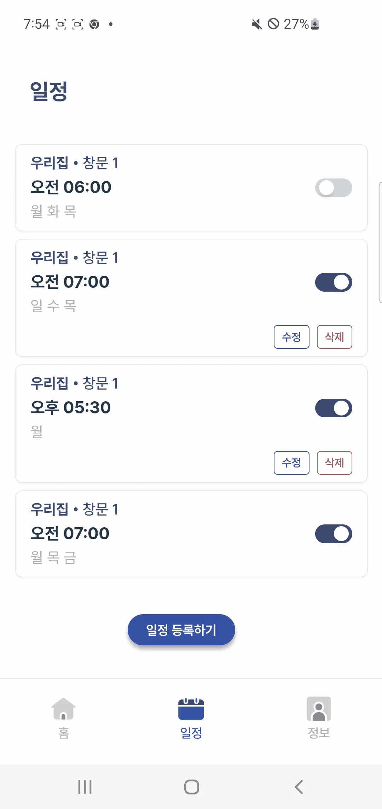
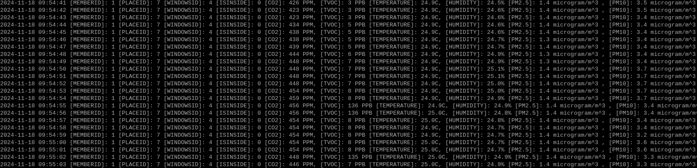
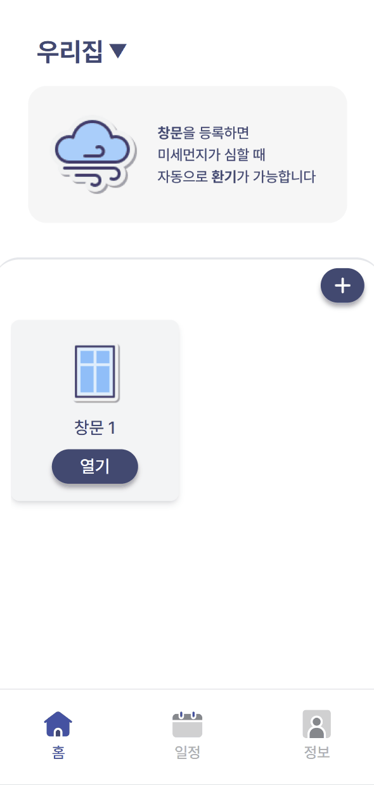
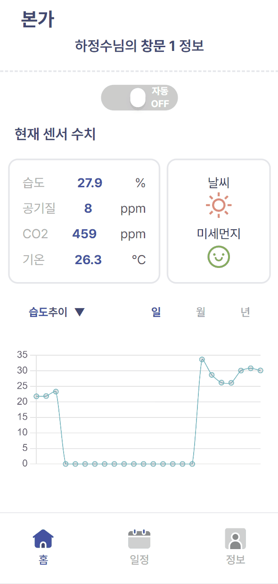

# 🔛 윈도어맨.
###  [스마트 창문 자동화를 통해 실내 및 실외의 쾌적한 환경을 유지하는 솔루션]

### 🌟 서비스 주소
- 서비스의 실제 동작을 확인할 수 있는 [서비스 링크](https://k11b107.p.ssafy.io) 🌍
---

### 📸 기능 별 스크린 샷
주요 기능의 스크린샷을 통해 인터페이스와 사용 방법을 미리 확인하세요 📸
<!-- - **실시간 공기질 모니터링**  
  

---

- **자동 창문 제어**  
   -->

---

- **사용자 맞춤 스케줄링 서비스**  
  <table style="width: 100%;">
    <tr>
      <td style="text-align: center; width: 50%;">
        
      </td>
      <td style="text-align: center; width: 50%;">
        
      </td>
    </tr>
  </table>

---

- **로그 데이터 분산 적재**  
  
---

- **실시간 공기질 모니터링 및 그래프 확인**  
  
---

- **이상치 감지 및 대처 기록 확인**  
  
---

## 👥 팀원 소개

**팀명**: WINDOW11

<table>
  <tr>
    <td style="text-align: center; padding: 10px;">
      
      <h4>김민경</h4>
      <p><strong>역할:</strong>팀장, BE</p>
      <p><strong>연락처:</strong> alsrud869@gmail.com </p>
      <p><strong>기술 블로그:</strong> <a href="https://github.com/formoin" target="_blank">github.com/민경</a></p>
    </td>
    <td style="text-align: center; padding: 10px;">
      
      <h4>박상필</h4>
      <p><strong>역할:</strong> AI / DATA</p>
      <p><strong>연락처:</strong> pagerank990@gmail.com</p>
      <p><strong>기술 블로그:</strong> <a href="https://sangphilpark.github.io/about/" target="_blank">Git-io</a></p>
    </td>
    <td style="text-align: center; padding: 10px;">
      
      <h4>이재민</h4>
      <p><strong>역할:</strong> BE </p>
      <p><strong>연락처:</strong> jml6534@naver.com</p>
      <p><strong>GIT:</strong> <a href="https://github.com/korno1" target="_blank">github.com/재민</a></p>
    </td>
  </tr>
  <tr>
    <td style="text-align: center; padding: 10px;">
      
      <h4>이찬호</h4>
      <p><strong>역할:</strong> IoT, INFRA</p>
      <p><strong>연락처:</strong> leechanho96@naver.com</p>
      <p><strong>GIT:</strong> <a href="https://github.com/mpegmafia" target="_blank">github.com/찬호</a></p>
    </td>
    <td style="text-align: center; padding: 10px;">
      
      <h4>하정수</h4>
      <p><strong>역할:</strong> FE </p>
      <p><strong>연락처:</strong> htg770@gmail.com</p>
      <p><strong>GIT:</strong> <a href="https://github.com/werocktoparty" target="_blank">github.com/정수</a></p>
    </td>
    <td style="text-align: center; padding: 10px;">
      
      <h4>홍경현</h4>
      <p><strong>역할:</strong> BE</p>
      <p><strong>연락처:</strong> hyeon21owo@gmail.com</p>
      <p><strong>GIT:</strong> <a href="https://github.com/honggyeonghyeon" target="_blank">github.com/경현</a></p>
    </td>
  </tr>
</table>


### 📚 프로젝트 개요
이 프로젝트는 실시간 센서 데이터를 기반으로 창문을 자동으로 열거나 닫는 시스템을 개발하는 것을 목표로 합니다. 사용자 정의 일정에 맞춰 창문을 제어하고, 실내외 공기질 데이터를 분석하여 최적의 상태를 유지하도록 돕습니다. 이 프로젝트는 주로 Raspberry Pi, Spring Boot, MQTT, Elasticsearch 등을 활용합니다.

### 🌟 주요 기능
- **실시간 공기질 모니터링**: CO₂, TVOC, PM2.5, PM10, 온도, 습도 센서를 통해 실내외 공기질 데이터를 실시간으로 수집하고 모니터링합니다. 이를 통해 사용자에게 정확한 실내외 공기 상태를 제공합니다.
- **자동 창문 제어**: 수집된 데이터를 분석하여 실내 공기질이 특정 기준을 초과하거나 악화될 경우, 창문을 자동으로 열거나 닫아 실내 환경을 최적화합니다. 이는 건강하고 쾌적한 실내 환경을 유지하는 데 큰 도움을 줍니다.
- **사용자 맞춤 알림 서비스**: 공기질 변화가 감지되거나 사용자 정의 이벤트가 발생할 때 즉시 알림을 전송하여 사용자가 실내 환경을 빠르게 파악하고 대처할 수 있도록 돕습니다.
- **유연한 스케줄링 기능**: 사용자가 설정한 요일과 시간에 따라 창문을 자동으로 열고 닫는 기능을 제공합니다. 사용자 맞춤형 일정 설정을 통해 편리함을 더합니다.
- **데이터 시각화**: 실내외 공기질 데이터를 시각적으로 표현하여 사용자가 쉽게 이해할 수 있도록 돕습니다. 실시간 그래프와 히스토리 데이터를 통해 환경 변화 추이를 파악할 수 있습니다.
- **이상치 감지 및 대처**: 공기질 데이터에서 이상치를 실시간으로 감지하여, 급격한 환경 변화에 대응할 수 있는 기능을 제공합니다. 이는 공기질이 급격히 악화될 경우 즉각적인 환기를 통해 위험을 줄여줍니다.

### 🛠️ 기술 스택
- **하드웨어**: Raspberry Pi 4, CO₂, TVOC, 온도, 습도 센서
- **백엔드**: Spring Boot, FastAPI
- **데이터 처리**: Elasticsearch, Redis, Logstash
- **메시지 브로커**: MQTT
- **클라이언트**: React, Chart.js


### 🎨 기능 별 구현 내용 및 역할
| 영 역 | 구현한 기능 | 팀 원 | 역할 및 기여도 |
| --- | --- | --- | --- |
| Frontend | React를 이용한 실시간 데이터 시각화 (Chart.js 사용) | 하정수 | 실시간 데이터 시각화 구현, 사용자 인터페이스 최적화 |
|  | Server-Sent Events (SSE) 구현을 통한 실시간 알림 기능 | 하정수 | SSE 기반 실시간 알림 기능 개발, 사용자 경험 향상 |
|  | 사용자 알람 설정 UI 개발 | 하정수 | 알람 설정 UI 설계 및 사용자 친화적 기능 구현 |
| Backend | MQTT 및 SSE를 활용한 실시간 센서 데이터 수집 및 처리 | 김민경 (팀장) | MQTT를 통한 센서 수집 데이터 구독 및 SSE를 통한 실시간 데이터 반환 |
|  | ElasticSearch 데이터 전송 API 개발 | 김민경 (팀장) | ElasticSearch와 백엔드 서버 연동하여 저장된 센서 데이터 호출 |
|  | Redis를 활용한 최신 센서 데이터 캐싱 기능 | 김민경 (팀장) | 캐싱 전략 설계, 실시간 데이터 접근성 개선 |
|  | 스케줄 관리 기능 개발 | 이재민 | 스케줄링 기능 설계 및 구현, 사용자 맞춤 알람 기능 도입 |
|  | Spring Batch를 이용한 대용량 데이터 수집 및 처리 | 이재민 | 대용량 데이터 배치 처리 설계 및 개발, 주기적 데이터 처리 자동화 |
|  | ThreadPool을 이용한 병렬 처리 | 이재민 | 스레드 관리 및 재사용, Job 병렬 처리 |
|  | 공기질 데이터 처리 및 리포트 API 개발 | 홍경현 | ElasticSearch 데이터 처리 및 스케줄링 구현, RESTful API 개발 |
|  | Spring Security를 통한 API 보안 설정 | 홍경현 | 보안 설정 및 인증/인가 메커니즘 구현 |
|  | 사용자 인증 및 JWT 기반 로그인 기능 | 홍경현 | 인증 시스템 구축 및 사용자 인증 로직 개발 |
| AI / 데이터 분석 | 강화학습 모델 설계 및 학습 (DQN, EKF 활용) | 박상필 | 강화학습 모델 연구 및 설계, 실험적 적용 및 성능 개선 |
|  | 이상치 탐지 모델 개발 및 데이터 전처리 작업 | 박상필 | 데이터 전처리 및 이상치 탐지 알고리즘 개발 |
|  | 데이터 시뮬레이터 구축 (한국 조건을 반영한 데이터 생성) | 박상필 | 시뮬레이션 데이터 생성, 한국 환경 반영한 모델링 |
| IoT / 인프라 | 라즈베리 파이 기반 센서 데이터 수집 및 제어 시스템 구축 | 이찬호 | 센서 데이터 수집 시스템 구축, 하드웨어 통합 및 관리 |
|  | MQTT 프로토콜을 이용한 센서 데이터 전송 기능 | 이찬호 | MQTT 프로토콜 구현, 안정적인 데이터 전송 설계 |
|  | AWS 기반 Docker 컨테이너 관리 및 ELK 스택 구축 | 이찬호 | 클라우드 인프라 관리, 로그 수집 및 모니터링 환경 구축 |


### 🤖 AI 핵심 로직
이 프로젝트의 AI 핵심 로직은 실내외 공기질 데이터를 분석하여 창문을 자동으로 제어하는 데 있습니다. 다음과 같은 알고리즘과 모델을 사용하여 공기질 상태를 평가하고 창문을 열거나 닫는 결정을 내립니다:

1. **이상치 탐지 모델**:
   - **Autoencoder**와 같은 비지도 학습 모델을 사용하여 공기질 데이터에서 이상치를 탐지합니다.
   - 이 모델은 정상 데이터를 학습한 후, 갑작스러운 변화나 비정상 패턴을 감지하여 창문을 열거나 닫는 트리거로 사용합니다.

2. **강화 학습 기반 제어 (DQN + EKF)**:
   - **Deep Q-Network (DQN)**을 사용해 창문 제어 정책을 최적화합니다.
   - DQN은 실내 공기질과 외부 조건을 고려하여 창문을 열거나 닫았을 때의 보상을 학습합니다.
   - **확장 칼만 필터 (EKF)**는 상태 예측의 정확성을 높이는 역할을 하며, DQN의 입력으로 사용될 상태 정보를 더 정밀하게 만들어 강화 학습 성능을 향상시킵니다.

3. **확장 칼만 필터 (EKF) 기반 예측**:
   - 실내외 공기질 변화를 예측하고, 예측 값과 실제 측정 값의 차이를 분석합니다.
   - 이를 통해 갑작스러운 변화에 즉각적으로 대응하고 창문을 자동으로 제어합니다.

4. **상황 인식 및 의사결정**:
   - 현재 공기질 상태와 사용자가 설정한 조건 (예: 특정 시간에 환기)을 종합적으로 고려합니다.

### 📊 시스템 구조
이 프로젝트는 센서 데이터를 MQTT를 통해 수집하고, Logstash와 Filebeat를 사용해 Elasticsearch에 저장합니다. Spring Boot는 서버로서 스케줄 관리 및 자동 창문 제어 로직을 처리하며, 사용자는 React 클라이언트를 통해 실시간 데이터를 시각적으로 확인할 수 있습니다. 데이터는 Redis를 통해 캐시되며, 실시간 알림과 빠른 데이터 접근을 지원합니다.


### 🚀 설치 및 실행 방법
1. **Raspberry Pi 설정**: Raspberry Pi에 센서를 연결하고 MQTT 브로커를 설정합니다.
2. **백엔드 서버 실행**: Spring Boot와 FastAPI 서버를 실행하여 데이터를 처리합니다.
3. **프론트엔드 실행**: React 클라이언트를 실행하여 실시간 데이터를 모니터링합니다.
4. **Elasticsearch 및 Redis 설정**: 데이터 저장 및 캐시를 위한 Elasticsearch와 Redis를 설정합니다.

<br>

## 프로젝트 구조
```
WINDOORMAN
📂 S11P31B107
├── 📂 .gitlab
│   ├── 📂 issue_templates
│   └── 📂 merge_request_templates
├── 🤖 AI
│   ├── 📂 autoencoder
│   │   └── 📂 configs
│   ├── 📂 ensemble
│   │   └── 📂 __pycache__
│   ├── 📂 models
│   └── 📂 reinforcement
├── 🖥️ Back
│   └── 📂 windoorman
│       ├── 📂 gradle
│       │   └── 📂 wrapper
│       └── 📂 src
│           ├── 📂 main
│           │   ├── 📂 java
│           │   │   └── 📂 com
│           │   │       └── 📂 window
│           │   │           ├── 📂 domain
│           │   │           │   ├── 📂 member
│           │   │           │   ├── 📂 monitoring
│           │   │           │   ├── 📂 place
│           │   │           │   ├── 📂 report
│           │   │           │   ├── 📂 schedule
│           │   │           │   ├── 📂 whitelist
│           │   │           │   ├── 📂 windowAction
│           │   │           │   └── 📂 windows
│           │   │           └── 📂 global
│           │   │               ├── 📂 config
│           │   │               ├── 📂 entity
│           │   │               ├── 📂 exception
│           │   │               ├── 📂 security
│           │   │               └── 📂 util
│           │   └── 📂 resources
│           └── 📂 test
│               └── 📂 java
│                   └── 📂 com
│                       └── 📂 window
├── 📂 docs_assets
├── 📂 exec
└── 🌐 FE
    ├── 📂 dev-dist
    ├── 📂 public
    │   └── 📂 icons
    └── 📂 src
        ├── 📂 assets
        │   ├── 📂 fonts
        │   ├── 📂 login
        │   ├── 📂 monitoring
        │   ├── 📂 navbar
        │   ├── 📂 report
        │   └── 📂 window
        ├── 📂 components
        │   ├── 📂 home
        │   ├── 📂 info
        │   ├── 📂 monitoring
        │   ├── 📂 navbar
        │   └── 📂 schedule
        ├── 📂 instance
        ├── 📂 pages
        │   ├── 📂 InfoPage
        │   ├── 📂 LoginPage
        │   ├── 📂 SchedulePage
        │   └── 📂 WindowPage
        └── 📂 stores
```

### 설명
- **🤖 AI**: AI 모델 관련 파일들이 포함된 디렉토리.
- **🖥️ BE**: 백엔드 애플리케이션 코드.
- **🌐 FE**: 프론트엔드 애플리케이션 코드.


## 🤝 형상 관리 컨벤션
기여를 원하시면 이 저장소를 포크하고, 브랜치를 생성한 후 풀 리퀘스트를 보내주세요! 🙌

### 🔧 기여 규칙
- **코드 스타일**: PEP8을 준수해주세요 📝
- **PR 설명**: 변경 사항과 의도를 명확하게 설명해주세요 📄

## 🔒 보안 주의사항
- 데이터베이스와 환경 변수를 설정할 때 민감한 정보는 `.env` 파일에 안전하게 보관하세요 🔐
- 외부에 노출되지 않도록 주의해주세요!

## 📞 문의
- 이슈나 질문은 MatterMost 혹은 이메일을 통해 남겨주세요 📝

<br>

감사합니다! 🙇‍♂️🙇‍♀️


---

#### 주관: 삼성전자, 삼성 청년 소프트웨어 아카데미(SSAFY)
윈도어맨 프로젝트의 핵심 로직에 대해 좀 더 명확하고 가독성 있게 설명해드리겠습니다.
